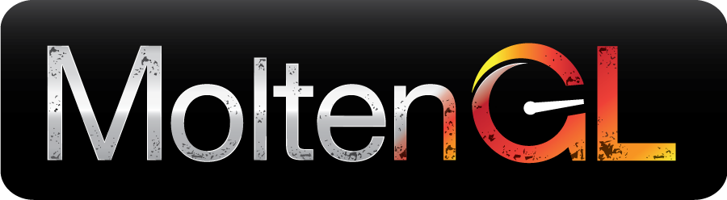

#MoltenGL Demo Projects

Copyright (c) 2014-2019 [The Brenwill Workshop Ltd.](http://www.brenwill.com) All rights reserved.

*This document is written in [Markdown](http://en.wikipedia.org/wiki/Markdown) format. 
For best results, use a Markdown reader.*

Table of Contents
-----------------

- [Introduction](#intro)
- [Comparing *MoltenGL* against *OpenGL ES*](#metal-vs-ogles)
- [Adding Support for Native *OpenGL ES 2.0* in *macOS*](#ogles-osx)
- [DrawLoad Demo Application](#drawload)
- [Particles Demo Application](#particles)

Introduction
------------

The *Xcode* projects in this folder are a set of demo applications that demonstrate the 
situations when implementing your *OpenGL ES* rendering in *Metal* via **MoltenGL** can 
improve the rendering performance of your *OpenGL ES* application.

To review and run all of the available demo apps, open the `Demos.xcworkspace` 
*Xcode* workspace in *Xcode*.

Each demo app can be configured to render *OpenGL* calls using the native *OpenGL ES* 
engine, or render the same *OpenGL* calls using *Metal*, by redirecting the *OpenGL* calls
to **MoltenGL**.

Comparing *MoltenGL* against *OpenGL ES*
----------------------------------------

In each demo app, the selection of whether to render using *OpenGL ES* or *Metal* is handled
by the value of the `MGL_SUPPORT_OPENGL_ON_METAL` parameter, as set in the **Preprocessor Macros** 
(aka `GCC_PREPROCESSOR_DEFINITIONS`) *Xcode* build setting. Setting the value of this parameter 
to `0` will cause rendering to be performed by the native *OpenGL ES* engine. Setting the 
value of this parameter to `1` will cause rendering to be performed by *Metal*, by redirecting
all *OpenGL* calls to **MoltenGL**.

To change whether a demo app uses *Metal* or native *OpenGL ES* to render:

1. Open the `Demos.xcworkspace` workspace in *Xcode*.

2. In the *Project Navigator* panel, select a demo app project.

3. Select either the *iOS* or *macOS* target of the demo app project.

3. In the *Build Editor* pane, select the *Build Settings* tab.

4. Locate the **Preprocessor Macros** (aka `GCC_PREPROCESSOR_DEFINITIONS`) build setting
   for the target.

5. Change the value of the `MGL_SUPPORT_OPENGL_ON_METAL` parameter to `0` to render using native 
   *OpenGL ES*, or `1` to render using *Metal*:

		MGL_SUPPORT_OPENGL_ON_METAL=0
		          -- or --
		MGL_SUPPORT_OPENGL_ON_METAL=1

6. If you are configuring to test native *OpenGL ES* under *macOS*, you must provide a 
   native *OpenGL ES* implementation. You can do this by following the instructions 
   in the [Adding Support for Native *OpenGL ES 2.0* in *macOS*](#ogles-osx) section below, 
   for each demo project.

7. Build and run the demo app. 

The demo app displays an on-screen indication that rendering is being performed by either 
*MoltenGL* or native *OpenGL ES*, and also displays the average *frames-per-second (**FPS**)* 
in the lower-left corner of the screen.

For correct evaluation of app performance, ensure that the *Xcode* build *Scheme* is set 
to use **Release** mode. This is the default mode for each demo app. If you build using 
**Debug** mode, the demo app will display a `[DEBUG]` indicator on the screen, to indicate
that performance measurements are not accurate.

> On *macOS*, comparing *OpenGL ES* to **MoltenGL** is a skewed comparison. Since *macOS* does 
> not natively support *OpenGL ES*, most "native" *OpenGL ES* implementations on *macOS* 
> (including the one described in the [section below](#ogles-osx)), must convert *OpenGL ES*
> calls and state to desktop *OpenGL* calls and state. Since there is always some level of 
> overhead in managing that conversion, one could say **MoltenGL** has a bit of an unfair 
> advantage in these comparisons (relative to, say, comparing against a true native desktop
> *OpenGL* implementation).
>
> However, performing the comparison on *macOS* anyway does highlight the important point
> that **MoltenGL** enables you to seamlessly port an *OpenGL ES* application that you might 
> have written for *iOS* to *macOS* without having to convert your application to desktop 
> *OpenGL*. You can leave your application implemented in *OpenGL ES* (including the shaders)
> and gain the strength of *Metal* to power your application on *macOS*. 

Adding Support for Native *OpenGL ES 2.0* in *macOS*
----------------------------------------------------

**MoltenGL** supports *OpenGL ES* under *macOS*, and all of the demo applications will run 
correctly on *macOS* when *Metal* is available (*El Capitan* and above).

However, when *Metal* is not available under *macOS*, in order to run any of the demo 
applications using native *OpenGL ES* under *macOS*, a "native" *OpenGL ES* implementation 
must be provided. This is because *macOS* supports desktop *OpenGL* by default, not *OpenGL ES*.

You can use any "native" *OpenGL ES* implementation for *macOS* you prefer. If you do not already 
have a preference, you can [download a free implementation here](https://moltengl.com/downloads/#ogles-osx).
This implementation contains both *OpenGL ES 2.0* and *EGL* libraries, and converts *OpenGL ES 2.0* 
calls to the desktop *OpenGL* calls available on *macOS*.

To configure the demo apps for testing with this "native" implementation of *OpenGL ES*, 
perform the following steps (or follow similar steps if you already have a preferred 
implementation of *OpenGL ES* for *macOS*). 

> Remember that you do **_not_** need to perform these steps in order to run the demo 
> apps under *macOS* when *Metal* is available.

Unzip the downloaded file, and move the `libGLESv2.dylib` and `libEGL.dylib` files to 
the `Demos/Common/PVRShell/macOS/OGLES2` folder in the **MoltenGL** distribution.

For each demo app that you want to test using "native" *OpenGL ES* under *macOS*, follow these steps:

1. Open the `Demos.xcworkspace` workspace in *Xcode*.

2. In the *Project Navigator* panel, select a demo app project.

3. In the *Project Navigator* panel, remove the **_references_** to the `gl.m` and `egl.m` files
   from the `Support/PVRShell/macOS` group of the demo app project. 
   
4. Drag the `libGLESv2.dylib` and `libEGL.dylib` files (which you added above) from the 
   `Demos/Common/PVRShell/macOS/OGLES2` folder to the *Frameworks/macOS* group in the 
   *Xcode Project Navigator* panel. In the dialog that opens, add the files to the **_macOS_** target.
   
5. Select the demo app project in the *Project Navigator* panel, select the *macOS* target,
   and select the *Build Phases* tab. Drag the `libGLESv2.dylib` and `libEGL.dylib` files from
   the *Frameworks/macOS* group in the *Xcode Project Navigator* panel to the *Copy Files* list
   in the *Build Phases* tab.
   
   > **Hint:** If you find it difficult to select both files in the *Frameworks/macOS* group without 
   switching away from the *Build Phases* tab of the project target, use the `Command` key on your 
   keyboard when selecting each of the files, or try dragging the files one by one from the 
   *Frameworks/macOS* group to the *Copy Files* list in the *Build Phases* tab.

6. Follow the instructions in the [section above](#metal-vs-ogles) to configure the demo app
   to use *Metal* instead of *OpenGL ES*. 

DrawLoad Demo Application
-------------------------

The `DrawLoadDemo` demo app displays a large collection of colored balls actively bouncing
around the scene. Each ball is rendered using one *OpenGL* draw call, meaning the number of 
draw calls made during each frame is about the same as the number of balls displayed. 
In addition, since each ball is a different color, and the balls are moving around, several 
*OpenGL* state calls are made prior to each draw call. The result is a very large number
of *OpenGL* calls on each frame.

In the bottom left corner of the screen, the demo displays the number of draw calls being
performed each frame, the number of triangles being rendered each frame (both per draw
call and total per frame), and the average number of frames-per-second being rendered.

This demo app demonstrates the conditions under which *Metal* (via **MoltenGL**) performs
better than *OpenGL*, and the conditions under which both *Metal* and *OpenGL* perform
about the same.

You can change the number of balls being rendered by swiping up or down on the screen
under *iOS*, or by using the cursor keys under *macOS*. To see the performance improvement 
provided by *Metal* (via **MoltenGL**), increase the number of balls being rendered until
you see the frame rate drop below 60 fps for each of *OpenGL* and **MoltenGL** (see the 
[section above](#metal-vs-ogles) for how to switch between *OpenGL* and **MoltenGL**).

Another aspect that affects performance for both *OpenGL* and *Metal* is the complexity
of the meshes (number of vertices and faces) being rendered. To see the effect of varying 
the mesh complexity of each ball, modify the value of the `MGL_DEMO_POLY_SIZE` parameter 
in the **Preprocessor Macros** (aka `GCC_PREPROCESSOR_DEFINITIONS`) build setting of the 
demo app target (the `DrawLoadDemo-iOS` or `DrawLoadDemo-macOS` target) within *Xcode*. 
Valid values for this parameter are `80`, `320` and `1280`, corresponding to meshes with
80, 320, and 1280 triangle faces per ball, respectively.

Because *Metal* is much more efficient than *OpenGL* when performing graphics engine calls, 
the performance improvement provided by *Metal* is most apparent when a large number of balls 
are being rendered, **_and_** the mesh complexity of each ball is lower. For instance, you 
should notice that, in this app, **MoltenGL** is about twice as fast as *OpenGL* for the ball
mesh with 80 faces, and a large number of balls.

As you increase the complexity of each ball mesh, the GPU must spend more and more time 
simply rendering vertices and fragments, causing the GPU to eventually become the bottleneck. 
In applications where raw rendering in the GPU is the bottleneck, the performance of *OpenGL* 
and *Metal* will be about the same. For instance, for the ball mesh with 320 faces, you should 
notice that *Metal* is still much faster than *OpenGL*, but the improvement is not quite as 
strong as when using the less-complex mesh with 80 faces. Similarly, for the ball mesh with
1280 faces, you should notice that *Metal* performs about the same as *OpenGL*. 

Understanding this demo app will help you optimize your own apps, to benefit the most in
the transition from *OpenGL* to *Metal*. If your app is limited by the GPU (the raw rendering
of vertices and fragments), or by CPU effort spent away from the graphics engine (for
instance, physics calculations, or other app control), you may not see much improvement from 
*Metal*. Once you have optimized those components, so that calls to the *OpenGL* graphics
engine become the bottleneck, the improved performance of *Metal* will shine through.

You can pause or resume the movement in the scene by tapping on the screen under *iOS*,
or by pressing either the `1` or `2` key under *macOS*.

Particles Demo Application
--------------------------

The `ParticlesDemo` demo app displays a large collection of point particles. The particles
are active and move around the scene, but all of the particles are rendered using a single 
*OpenGL* draw call.

In the bottom left corner of the screen, the demo displays the number of particles and the 
average number of frames-per-second being rendered.

You can change the number of particles being rendered by swiping up or down on the screen
under *iOS*, or by using the cursor keys under *macOS*.

Even though the scene is very active, because point-particle rendering is performed with 
a very small number of draw calls, this demo app demonstrates a situation where *Metal* 
improves performance a relatively small amount over native *OpenGL ES* (typically a 
10% - 20% improvement on modern hardware).

You can pause or resume the movement in the scene by tapping on the screen under *iOS*,
or by pressing either the `1` or `2` key under *macOS*.

---------------

The **MoltenGL** demo apps include components of the 
[*PowerVRTM SDK*](http://community.imgtec.com/developers/powervr/) from 
[Imagination Technologies Limited](http://imgtec.com). The *PowerVRTM SDK* 
is freely available through an open-source license, with attribution required.

